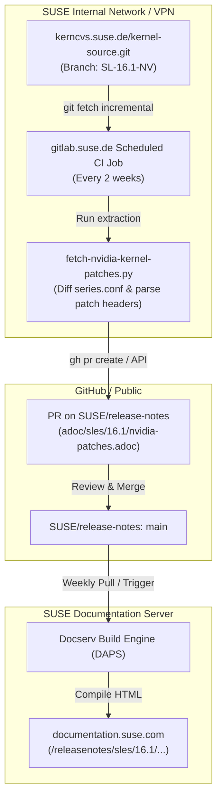

# Automated Workflow for Publishing NVIDIA Kernel Patches

## Overview

This document specifies an automated workflow to extract, process, and publish the list of NVIDIA kernel patches for SUSE Linux Enterprise Server (SLES) 16.1 and future releases.

The list of patches changes approximately every two weeks during initial development phases and less frequently later in the product lifecycle. Because the patch list contains more than 200 items, it is maintained as a separate, linked document or file to preserve the readability of the main release notes.

---

## 1. Problem Statement and Constraints

1. **Source Repository Size & Access**:
   * **Source**: `https://github.com/SUSE/kernel-source` (public GitHub mirror) or `git://kerncvs.suse.de/kernel-source.git` (branch `SL-16.1-NV` compared against `origin/SL-16.1`).
   * **Size**: ~4.5 GB full repository, ~70 MB for depth-1 shallow fetch, or instant via HTTPS raw blob API.
   * **Network Boundary**: The public GitHub mirror (`https://github.com/SUSE/kernel-source`) is accessible globally without VPN. Both GitHub Actions and GitLab CI runners access it directly.
2. **Data Extraction**:
   * The patches to document are added to `series.conf` on the NVIDIA branch (`SL-16.1-NV`) relative to the base release (`origin/SL-16.1`).
   * Each patch file in `patches.suse/` contains metadata headers:
     * `Git-commit`: Upstream Linux kernel commit hash.
     * `Patch-mainline`: Upstream mainline kernel version tag (e.g., `v6.13-rc1`).
     * `References`: Tracking IDs (e.g., `jsc#NVIDIA-55`, `bsc#1272627`).
     * `Subject`: One-line patch summary.
   * Extraction logic exists in Ruby (`scripts/printpatchset` on branch `scripts`) and Python (`scripts/fetch-nvidia-kernel-patches.py`).
3. **Publishing Target**:
   * SUSE Documentation Server (`docserv`), which builds and serves content on `documentation.suse.com` (d.s.c).
   * Docserv clones `https://github.com/SUSE/release-notes.git` (`main` branch) and compiles deliverables using DAPS.
   * Apache rewrite rules in `docserv-config/server-root-files-doc-suse-com/.htaccess` control URLs under `https://documentation.suse.com/releasenotes/<product>/<version>/`.

---

## 2. Proposed Approaches

### Approach 1 (Recommended): GitLab CI Scheduled Pipeline + AsciiDoc Deliverable

* **Extraction Runner**:
  * Run a scheduled pipeline on internal SUSE GitLab (`gitlab.suse.de`) every two weeks.
  * Internal runners have direct network access to `kerncvs.suse.de`.
  * The job caches the repository or uses `git fetch --depth 1` / blobless clones (`--filter=blob:none`) to eliminate repeated 4.5 GB downloads.
  * An automated Python script executes `scripts/fetch-nvidia-kernel-patches.py`, parses the patch metadata, and outputs a formatted AsciiDoc file: `adoc/sles/16.1/nvidia-patches.adoc`.
  * The pipeline commits the file to a branch and creates a Pull Request on `SUSE/release-notes` via a GitHub token / bot.
* **Publishing**:
  * Configured as a deliverable in `docserv-config/config.d/releasenotes.xml` (e.g., `DC-releasenotes_sles-nvidia_16.1`) or as an included appendix.
  * Linked from `adoc/sles/version161.adoc` under the relevant architecture/hardware section.
  * Docserv builds the deliverable automatically on its regular Thursday schedule or on request.
* **Advantages**:
  * Fully automated end-to-end.
  * Follows standard SUSE documentation styling, search indexing, and DAPS toolchain.
  * Eliminates manual web server uploads and custom `.htaccess` exceptions.

---

### Approach 2: GitLab CI Scheduled Pipeline + Static File in Existing Docserv Rewrite

* **Extraction Runner**:
  * Same automated GitLab CI schedule on `gitlab.suse.de` as Approach 1.
  * The script generates a raw plain text file: `static/nvidia-patches.txt` (or inside the deliverable static path).
  * Automatically opens a PR to `SUSE/release-notes`.
* **Publishing**:
  * Uses the existing Apache rewrite rule in docserv's `.htaccess`:
    ```apache
    RewriteCond "%{DOCUMENT_ROOT}/en-us/releasenotes/$1/html/releasenotes_$1_$2/$3" -f
    RewriteRule "^releasenotes/([^/]+)/([^/]+)/(index\.html|static(/(.*)?))?" "/en-us/releasenotes/$1/html/releasenotes_$1_$2/$3" [PT,L]
    ```
  * Files under `static/` are served directly without modifying `.htaccess`.
  * Linked from `adoc/sles/version161.adoc` as a download link.
* **Advantages**:
  * Retains the requested plain `.txt` file format.
  * Does not require custom `.htaccess` modifications.
* **Disadvantages**:
  * Lacks doc navigation, styling, and metadata search indexing.
  * Requires verifying that DAPS copies the `static/` directory to docroot during compilation.

---

### Approach 3: Semi-Automated Local CLI Script + PR

* **Extraction Runner**:
  * A local shell script executed on the local workstation when connected to SUSE VPN.
  * Run bi-weekly on-demand or triggered by a local cron/calendar reminder.
  * Uses the existing local clone at `~/work/git/kernel-source`.
  * Executes the extraction script, updates `adoc/sles/16.1/nvidia-patches.adoc` (or `.txt`), creates a Git branch, and opens a GitHub PR with `gh pr create`.
* **Publishing**:
  * Merged into `SUSE/release-notes` `main` branch and built by docserv.
* **Advantages**:
  * Zero infrastructure setup required (no GitLab runner, no CI secret tokens).
  * Immediately operational.
* **Disadvantages**:
  * Requires manual intervention every two weeks.
  * Fails to update if the maintainer environment is unavailable.

---

## 3. Detailed Data Flow (Recommended Approach 1)



---

## 4. Implementation Plan

### Phase 1: Patch Extraction Script Enhancement
1. Update `scripts/fetch-nvidia-kernel-patches.py` to:
   * Extract `Git-commit`, `Patch-mainline`, `References` (`jsc#...`, `bsc#...`), and `Subject`.
   * Support an `--asciidoc` flag to format output directly as an AsciiDoc table.
   * Support a `--text` flag for plain-text tabular output.
2. Verify output locally against `~/work/git/kernel-source`.

### Phase 2: Documentation Integration
1. Add `adoc/sles/16.1/nvidia-patches.adoc` with proper document headers and metadata.
2. In `adoc/sles/version161.adoc`, add a note and cross-reference (`<<sec-nvidia-kernel-patches>>`) pointing to the NVIDIA kernel patches section included in `adoc/sles/release-notes-sles-161.adoc`.
3. Verify inclusion in the main deliverable with `make validate PRODUCT_VERSION=sles_16.1`.

### Phase 3: Automation Setup
1. Create a lightweight pipeline repository on `gitlab.suse.de` with scheduled execution (every 14 days).
2. Configure a GitHub personal access token / deploy key to allow automated branch push and PR creation on `SUSE/release-notes`.
3. Test a dry-run execution of the automated pipeline.

---

## 5. Operational Instructions

This section describes the procedure to configure and operate the automated workflow.

### 5.1 GitHub Actions Nightly Workflow (Recommended)

The automated synchronization workflow runs directly inside `SUSE/release-notes` via `.github/workflows/nvidia-sync.yml`.
The workflow runs nightly at 02:00 UTC via GitHub Actions scheduled cron.
It uses the public mirror `https://github.com/SUSE/kernel-source` and requires no external tokens.

1. Ensure GitHub Actions can open Pull Requests:
   * Open the repository **Settings** in `SUSE/release-notes`.
   * Navigate to **Actions** -> **General** -> **Workflow permissions**.
   * Select **Allow GitHub Actions to create and approve pull requests**.
   * Select **Save**.
2. Run manually at any time:
   * Navigate to **Actions** -> **Sync NVIDIA Kernel Patches**.
   * Select **Run workflow**.
   * Or run via `gh` CLI:
     ```bash
     gh workflow run nvidia-sync.yml
     ```

### 5.2 Project Setup on GitLab (Alternative)

You can also run the synchronization pipeline on `gitlab.suse.de`.

1. Log in to `gitlab.suse.de`.
2. Select **New Project** -> **Create blank project**.
3. Set the project name to `nvidia-patches-sync`.
4. Set the visibility level to **Internal**.
5. Push the repository containing `scripts/sync-nvidia-patches.sh` and the CI configuration:
   * Either copy `.gitlab-ci.nvidia-sync.yml` to `.gitlab-ci.yml`, or
   * Set **CI/CD configuration file** under **Settings** -> **CI/CD** -> **General pipelines** to `.gitlab-ci.nvidia-sync.yml`.

### 5.3 Secret Variable Configuration on GitLab

The GitLab runner requires a GitHub token to create pull requests on `SUSE/release-notes`.

1. Generate a GitHub Personal Access Token (PAT) with `repo` scope permissions.
2. Open the project on `gitlab.suse.de`.
3. Navigate to **Settings** -> **CI/CD** -> **Variables**.
4. Select **Add variable**.
5. Configure the variable:
   * **Key**: `GITHUB_TOKEN`
   * **Value**: `<github-personal-access-token>`
   * **Type**: `Variable`
   * **Flags**: Check **Mask variable** and **Protect variable**.
6. Select **Add variable**.

### 5.4 Pipeline Schedule Setup on GitLab

Set up a recurring pipeline schedule on GitLab.

1. Navigate to **Build** -> **Pipeline schedules** in the GitLab project.
2. Select **New schedule**.
3. Enter `Nightly NVIDIA Kernel Patch Sync` in **Description**.
4. Set **Interval Pattern** to **Custom** and enter the nightly cron schedule:
   `0 2 * * *` (Runs every day at 02:00 UTC).
5. Set **Target branch** to `main`.
6. Select the **Activated** checkbox.
7. Select **Save pipeline schedule**.

### 5.5 Docserv Build Verification

Verify that docserv successfully compiles and publishes the generated patch table.

1. Verify that the GitLab CI job executes `scripts/sync-nvidia-patches.sh` and opens a GitHub Pull Request when changes occur.
2. Merge the Pull Request into the `main` branch of `SUSE/release-notes`.
3. Verify local build validation using DAPS:
   ```bash
   make validate PRODUCT_VERSION=sles_16.1
   ```
4. Verify docserv compilation on `documentation.suse.com` after the scheduled docserv sync:
   * Confirm `adoc/sles/16.1/nvidia-patches-table.adoc` renders correctly inside `adoc/sles/16.1/nvidia-patches.adoc`.
   * Check that all patch commit links, mainline versions, and tracker references display cleanly.

### 5.6 Local Execution and Dry-Run Mode

Maintainers can run `scripts/sync-nvidia-patches.sh` directly on a local workstation without VPN:

1. Run in dry-run mode to check for patch changes without creating commits or pull requests:
   ```bash
   ./scripts/sync-nvidia-patches.sh --dry-run
   ```
2. Run in synchronization mode to update documentation and open a pull request:
   ```bash
   ./scripts/sync-nvidia-patches.sh
   ```
   The script detects authentication automatically:
   * Uses authenticated `gh` CLI if available (`gh auth status`).
   * Uses `GITHUB_TOKEN` environment variable in headless or CI environments.


